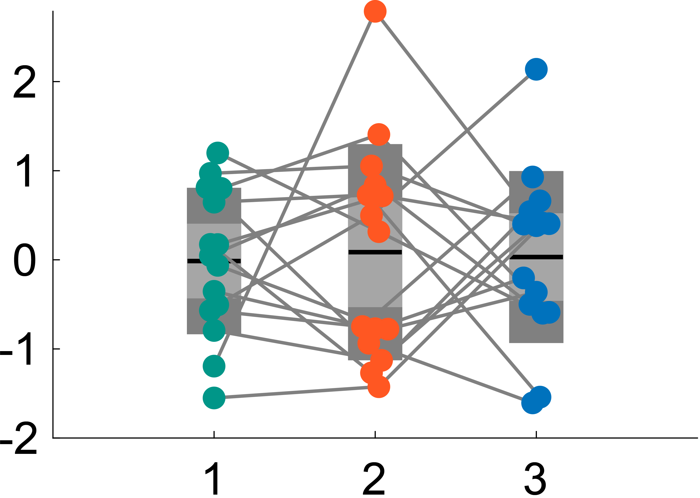

# notBoxPlot (Fork)

This is a fork of [raacampbell/notBoxPlot](https://github.com/raacampbell/notBoxPlot) with added support for **pairwise line plots** and **color modification**.

<p align="center">

</p>

## Added Features

### Pairwise Plot (`pairwiseplot_nbp`)
Draws lines connecting paired observations across groups, useful for visualizing within-subject or repeated-measures data. The function automatically handles the rendering order so that scatter points remain on top and patch elements stay in the background.

```matlab
obj_nbp = notBoxPlot(data_input);
pairwiseplot_nbp(obj_nbp);            % default gray lines
pairwiseplot_nbp(obj_nbp, 0.5, 1.5);  % line color intensity, line width
pairwiseplot_nbp(obj_nbp, 0.5, 1.5, data_input); % pass raw data to handle NaN alignment
```

### Color Modification (`modify_notBoxPlot`)
Applies a clean color scheme: gray SD/SEM patches with colored data points (default: teal, orange, blue). Point size is also configurable.

```matlab
obj_nbp = modify_notBoxPlot(obj_nbp);           % default colors, point size 8
obj_nbp = modify_notBoxPlot(obj_nbp, 6);         % custom point size
obj_nbp = modify_notBoxPlot(obj_nbp, 8, colors); % custom colors (3xN matrix, RGB columns)
```

## Quick Start

```matlab
addpath('./code/');
data_input = randn(15, 3);

obj_nbp = notBoxPlot(data_input);
obj_nbp = modify_notBoxPlot(obj_nbp, 8);
pairwiseplot_nbp(obj_nbp);
set(gca, 'FontSize', 20);
```

---

## Original README

> The following is the original README from [raacampbell/notBoxPlot](https://github.com/raacampbell/notBoxPlot).

[](https://uk.mathworks.com/matlabcentral/fileexchange/26508-notboxplot)

notBoxPlot is a MATLAB data visualisation function. 

Whilst box plots have their place, it's sometimes nicer to see all the data, rather than hiding them with summary statistics such as the inter-quartile range. This function (with a tongue in cheek name) addresses this problem. The use of the mean instead of the median and the SEM and SD instead of quartiles and whiskers are deliberate.
Jittered raw data are plotted for each group. Also shown are the mean, and 95% confidence intervals for the mean. This plotting style is designed to be used alongside parametric tests such as ANOVA and the t-test. Comparing the jittered data to the error bars provides a visual indication of whether the normality assumptions of the statistical tests are being violated. Furthermore, it allows one to eyeball the data to look for significant differences between means (non-overlapping confidence intervals indicate a significant difference at the chosen p-value, which here is 5%). Also see: http://jcb.rupress.org/cgi/content/abstract/177/1/7 Finally, 1 SD is also shown. Note that if data are not normally distributed then these statistics will be less meaningful.

The function has several examples and there are various visualization possibilities in addition to those shown in the above screenshot. For instance, the coloured areas can be replaced by lines.

### Features
- Directly plot LinearModel objects from `fitlm`
- Easily mix a variety of plot styles on one figure
- Easy post-hoc modification of plot parameters via returned function handles
- Statistics (mean, SD, etc) optionally returned 
- Optional plotting of median in addition to mean 
- Option to plot either a 95% confidence interval for the mean or a 95% t-interval

### Included functions
- notBoxPlot.m - generates plots as shown in screenshot
- NBP.SEM_calc.m - calculate standard error of the mean
- NBP.tInterval_calc.m - calculate a t-interval
- NBP.example - makes a nice example plot

### Installation
Add the ``code`` directory to your MATLAB path. Some operations (such as t-interval calculation) depend on the Stats Toolbox.
